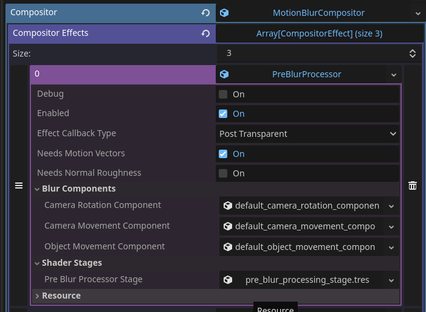

Sphynx's Simplified Motion Blur Toolkit
=====================================

In This Project
---------------

A cleaned and simplified implementation of the motion blur compositor effect to make it more accessible for implementation into godot.

Technical Overview
------------------

The technique I have settled on is a variation on Jean-Philippe Guertin et. al's implementation introduced in [this paper](https://research.nvidia.com/sites/default/files/pubs/2013-11_A-Fast-and/Guertin2013MotionBlur-small.pdf). 

It is robust and efficient, as well as highly configurable.

Due to missing and outright incorrect information that was present in the paper, I had a hard time recreating it myself, but then I came across an implementation by [keyjiro](https://github.com/keijiro/KinoMotion/commits?author=keijiro) called [KinoMotion](https://github.com/keijiro/KinoMotion), which was originally meant for unity, but still helped close a few holes that were present in the paper.

The main difference introduced by me is the blending heuristics, which are supposed to reflect a more physically accurate motion blur phenomenon. 

### Pre-Processing

Before the motion blur can be applied, a pre processing stage is carried out to perform a few things:

1. Add motion vectors to the skybox, as those are not available by default.
2. Add support for FSR2 supersampling. 
3. Add control and configurability to different components of the motion blur, which are camera rotation, camera motion, and object motion, separately.

This stage is carried out by the **PreBlurProcessor** compositor effect, thus it must be added before any motion blur compositor effect in the `compositor_effects` array.

### Guertin's motion blur

The motion blur method depicted in the article is carried out in 4 stages:

1. **Tile Max X** - In this stage, the most dominant velocity in the velocity buffer within each tile's row is stored into that tile's row in the output texture.

2. **Tile Max Y** - The most dominant velocity in the output texture from the Tile Max X stage within each tile's column is stored into a final tile as the dominant velocity of that tile.

3. **Neighbor Max** - A dominant velocity is picked from the neighboring tiles, dilating stronger velocities beyond their original tiles.

4. **Blur Reconstruction** - Combining all data textures using blending heuristics to reconstruct the blur effect in screen space.

It is carried out by the **GuertinMotionBlur** compositor effect.

