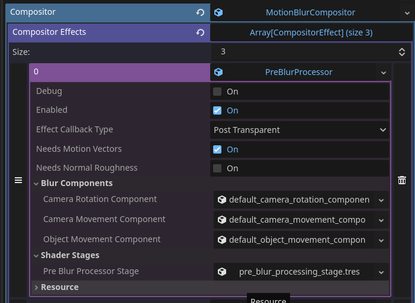
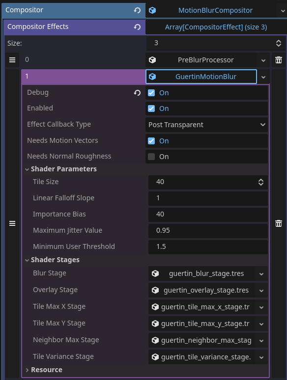
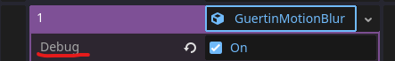
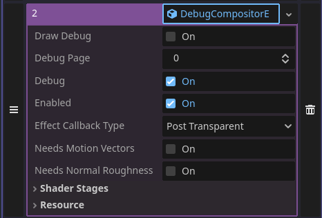

Sphynx's Simplified Motion Blur Toolkit
=====================================

In This Project
---------------

A cleaned and simplified implementation of the motion blur compositor effect to make it more accessible for implementation into godot.

Technical Overview
------------------

The technique I have settled on is a variation on Jean-Philippe Guertin et. al's implementation introduced in [this paper](https://research.nvidia.com/sites/default/files/pubs/2013-11_A-Fast-and/Guertin2013MotionBlur-small.pdf). 

It is robust and efficient, as well as highly configurable.

Due to missing and outright incorrect information that was present in the paper, I had a hard time recreating it myself, but then I came across an implementation by [keyjiro](https://github.com/keijiro/KinoMotion/commits?author=keijiro) called [KinoMotion](https://github.com/keijiro/KinoMotion), which was originally meant for unity, but still helped close a few holes that were present in the paper.

The main difference introduced by me is the blending heuristics, which are supposed to reflect a more physically accurate motion blur phenomenon. 

### Pre-Processing

Before the motion blur can be applied, a pre processing stage is carried out to perform a few things:

1. Add motion vectors to the skybox, as those are not available by default.
2. Add support for FSR2 supersampling. 
3. Add control and configurability to different components of the motion blur, which are camera rotation, camera motion, and object motion, separately.

This stage is carried out by the **PreBlurProcessor** compositor effect, thus it must be added before any motion blur compositor effect in the `compositor_effects` array.

You can find the script in `res://addons/sphynx_motion_blur_toolkit/pre_blur_processing/pre_blur_processor.gd`.
You can find the shader file that it uses in `res://addons/sphynx_motion_blur_toolkit/pre_blur_processing/shader_stages/shaders/pre_blur_processor.glsl`.
### Guertin's motion blur

The motion blur method depicted in the article is carried out in 4 stages:

1. **Tile Max X** - In this stage, the most dominant velocity in the velocity buffer within each tile's row is stored into that tile's row in the output texture. The shader file for it can be found in `res://addons/sphynx_motion_blur_toolkit/guertin/shader_stages/shader_files/guertin_tile_max_x.glsl`.

2. **Tile Max Y** - The most dominant velocity in the output texture from the Tile Max X stage within each tile's column is stored into a final tile as the dominant velocity of that tile. The shader file for it can be found in `res://addons/sphynx_motion_blur_toolkit/guertin/shader_stages/shader_files/guertin_tile_max_y.glsl`.

3. **Neighbor Max** - A dominant velocity is picked from the neighboring tiles, dilating stronger velocities beyond their original tiles. The shader file for it can be found in `res://addons/sphynx_motion_blur_toolkit/guertin/shader_stages/shader_files/guertin_neighbor_max.glsl`.

4. **Blur Reconstruction** - Combining all data textures using blending heuristics to reconstruct the blur effect in screen space. The shader file for it can be found in `res://addons/sphynx_motion_blur_toolkit/guertin/shader_stages/shader_files/guertin_sphynx_blur.glsl`. You can find the **KinoMotion** version of the implementation in `res://addons/sphynx_motion_blur_toolkit/guertin/shader_stages/shader_files/guertin_kino_blur.glsl`. The main difference will be that my blending heuristics achieve a result that is closer to the ground truth, and are more robust against motion in the z axis.

It is carried out by the **GuertinMotionBlur** compositor effect.

You can find the script in `res://addons/sphynx_motion_blur_toolkit/guertin/guertin_motion_blur.gd`.

### Optional Debug Stage

Adding a **DebugCompositorEffect** stage at the end of the `compositor_effects` array will let you display some useful debugging as its own post process effect. By default the blur and pre processing stages contain some functionality to support it, and all they need is to have `debug` enabled on them:

Then you can press Z to toggle the debug views, X to freeze and unfreeze the frame, and C to cycle between debug view "pages" if there are any.

You can also manually control the toggles in the editor.

(**Section in construction**)
A Deeper Dive
-------------

### Pre Blur Processing

As mentioned above, godot is quite limited in its motion vector buffer, as it is focused on being optimized.

This leaves us responsible to get velocities for the skybox and to handle the velocities when their behavior changes like they do with FSR2.

The way I do it is by extracting the velocity myself based on the current and previous frame's view matrices against the current frame's depth image.

This only works if the environment does not move, but because moving objects will always have velocities associated with them in godot's velocity buffer, I can simply ignore them and use their velocities as they are. For skybox however, which never shows velocity vectors, this is where I can extract velocity vectors for it myself.

In addition, I am able to separate the different velocity components based on the rotation of the view matrix between frame, its movement, and the objects movement as depicted by godot's velocity buffer.

Combining all of those techniques is what makes the pre blur processor stage.

